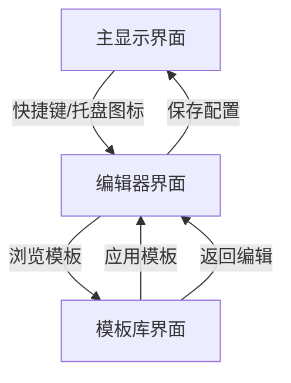

## 1. 产品概述
DecoScreenBeautifier是一款专为电脑桌搭和机箱副屏设计的CLI风格美化软件，采用复古未来主义和赛博朋克美学，通过命令行界面呈现动态彩色内容，为极客用户打造独特的副屏视觉体验。

解决传统副屏美化软件同质化严重的问题，为喜欢复古CLI风格的用户提供专业级定制化解决方案，适配小尺寸长条屏幕的特殊分辨率需求。

## 2. 核心功能

### 2.1 用户角色
本产品为单用户桌面应用，无需区分用户角色。

### 2.2 功能模块
DecoScreenBeautifier包含以下核心页面：
1. **主显示界面**：CLI风格的实时组件显示，支持硬件监控、时钟、音频可视化等组件的动态渲染
2. **编辑器界面**：可视化组件布局编辑器，支持拖拽、缩放、颜色自定义，提供实时预览功能
3. **模板库界面**：预设模板浏览和应用，包含多种风格和屏幕尺寸适配方案

### 2.3 页面详情
| 页面名称 | 模块名称 | 功能描述 |
|---------|---------|---------|
| 主显示界面 | 组件渲染引擎 | 实时渲染CLI风格组件，支持ANSI彩色输出和动态更新 |
| 主显示界面 | 布局管理器 | 精确控制组件位置和大小，适配不同分辨率的长条屏 |
| 主显示界面 | 动画系统 | 提供组件切换、故障艺术效果、像素动画等视觉特效 |
| 编辑器界面 | 组件工具箱 | 展示所有可用组件，支持拖拽添加到编辑区域 |
| 编辑器界面 | 属性面板 | 调整组件颜色、大小、样式参数，实时预览修改效果 |
| 编辑器界面 | 预览窗口 | 模拟CLI显示效果，提供编辑参考 |
| 模板库界面 | 模板分类 | 按风格（赛博朋克、复古像素、故障艺术）分类展示模板 |
| 模板库界面 | 模板预览 | 缩略图展示模板效果，支持一键应用 |
| 模板库界面 | 屏幕适配 | 提供不同尺寸（5寸、7寸长条屏等）的专门模板 |

## 3. 核心流程
用户启动软件后进入主显示界面，显示默认的CLI风格组件布局。用户可以通过快捷键或系统托盘图标访问编辑器界面，在编辑器中自定义组件布局、样式和颜色。编辑完成后保存配置，返回主显示界面实时查看效果。用户也可以从模板库中选择预设方案快速应用。

## 4. 用户界面设计

### 4.1 设计风格
- **主色调**：深黑色背景（#0D0208）搭配霓虹色彩（#00FF41、#FF00FF、#00FFFF）
- **辅助色**：故障艺术风格的噪点纹理和扫描线效果
- **字体**：等宽字体（Consolas、Courier New），支持像素字体选项
- **布局**：基于字符网格的精确布局，支持自定义网格大小（8x8到32x32）
- **图标**：ASCII字符组成的符号系统，避免使用图形图标

### 4.2 页面设计概览
| 页面名称 | 模块名称 | UI元素 |
|---------|---------|---------|
| 主显示界面 | CLI渲染区 | 全屏CLI窗口，黑色背景，支持ANSI转义的彩色字符显示 |
| 主显示界面 | 组件容器 | 矩形字符边框定义组件边界，支持透明度效果 |
| 编辑器界面 | 工具栏 | 顶部横向布局，包含文件、编辑、视图菜单 |
| 编辑器界面 | 编辑画布 | 网格背景，支持拖拽组件，显示组件边界和调整手柄 |
| 模板库界面 | 模板网格 | 卡片式布局，每个模板显示缩略图和名称 |

### 4.3 响应式设计
桌面优先设计，针对Windows平台优化，支持多种长条屏分辨率（800x480、1024x600、1280x400等）。提供分辨率自适应和手动调整选项。

### 4.4 CLI显示指导
- **字符集**：支持完整ASCII和扩展ANSI字符集
- **颜色深度**：16色基础调色板，支持256色扩展
- **动画帧率**：可配置（1-30fps），默认10fps平衡性能和效果
- **像素化处理**：图像转换算法支持阈值调整（2-16级）
- **故障效果**：随机噪点、扫描线、字符替换等特效参数可调