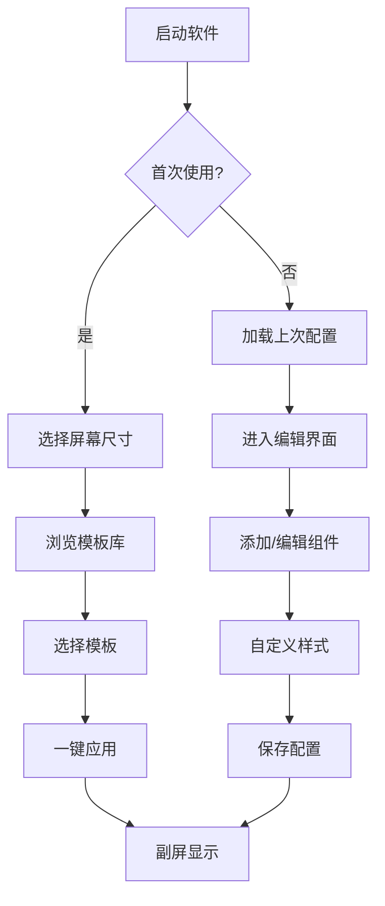

## 1. 产品概述
DecoScreenBeautifier是一款专为电脑桌搭和机箱监视副屏设计的美化软件，能够将小尺寸长条形屏幕转化为个性化的信息展示和装饰面板。该软件通过提供丰富的可视化组件和模板，帮助用户打造独特的桌面美学体验。

目标用户为追求个性化桌搭的电脑爱好者、机箱改装玩家以及需要副屏信息展示的用户。产品核心价值在于将功能性监视与美学设计完美结合，让技术设备也能成为桌面装饰的一部分。

## 2. 核心功能

### 2.1 用户角色
本产品为单机应用，无需用户注册登录系统。

### 2.2 功能模块
DecoScreenBeautifier包含以下核心页面：
1. **主编辑界面**：组件库浏览、画布编辑、属性面板、模板选择
2. **设置页面**：开机自启、显示设置、性能选项、关于信息

### 2.3 页面详情

| 页面名称 | 模块名称 | 功能描述 |
|---------|---------|----------|
| 主编辑界面 | 组件库面板 | 展示硬件监测、时钟、音频可视化等组件分类，每个组件提供3-5种外观预设 |
| 主编辑界面 | 画布编辑区 | 支持拖拽添加组件、调整大小位置、网格对齐、多层叠加 |
| 主编辑界面 | 属性面板 | 调整选中组件的颜色、透明度、字体、动画效果等参数 |
| 主编辑界面 | 模板库 | 按屏幕尺寸分类的预设模板，支持一键应用和自定义保存 |
| 主编辑界面 | 用户内容区 | 上传管理图片/GIF素材，设置为贴纸或背景 |
| 设置页面 | 系统设置 | 开关机自启动、最小化到系统托盘、显示分辨率适配 |
| 设置页面 | 性能设置 | 调整刷新频率、硬件加速选项、内存使用限制 |
| 设置页面 | 主题设置 | 切换深色/浅色主题、全局配色方案 |

## 3. 核心流程

### 主要用户操作流程：
1. **首次使用流程**：用户打开软件 → 选择屏幕尺寸 → 浏览模板库 → 选择喜欢的模板 → 一键应用 → 副屏显示美化内容
2. **自定义编辑流程**：进入编辑界面 → 从组件库拖拽组件到画布 → 调整组件位置和大小 → 自定义组件外观 → 保存为个人模板
3. **内容管理流程**：上传个人图片/GIF → 设置为背景或贴纸 → 调整透明度和混合模式 → 预览效果 → 保存配置

## 4. 用户界面设计

### 4.1 设计风格
- **主色调**：深空灰（#1a1a1a）搭配霓虹蓝（#00d4ff）作为强调色
- **按钮样式**：圆角矩形设计，悬停时有发光效果
- **字体选择**：Inter字体族，标题18-24px，正文14px
- **布局风格**：左侧组件库，中央画布编辑区，右侧属性面板的三栏布局
- **图标风格**：采用线性图标，配合微动画效果

### 4.2 页面设计概览

| 页面名称 | 模块名称 | UI元素 |
|---------|---------|--------|
| 主编辑界面 | 组件库面板 | 左侧边栏，图标+文字分类，悬停预览效果，玻璃拟态背景 |
| 主编辑界面 | 画布编辑区 | 中央主要区域，网格背景，拖拽虚线框，选中高亮边框 |
| 主编辑界面 | 属性面板 | 右侧边栏，滑块控制颜色/大小，下拉选择预设，实时预览 |
| 主编辑界面 | 模板库 | 模态窗口展示，缩略图预览，按分辨率分类标签 |

### 4.3 响应式设计
- **桌面优先**：针对1920x1080主屏幕设计编辑界面
- **副屏适配**：支持800x480、1920x480、1024x600等长条分辨率
- **缩放适配**：支持125%、150%等系统缩放比例
- **触控优化**：支持拖拽操作的触控手势识别

### 4.4 视觉效果指导
- **动画效果**：组件添加时的缩放淡入，拖拽时的阴影变化
- **过渡效果**：页面切换使用滑动过渡，参数调整实时响应
- **特效支持**：支持模糊、发光、粒子等视觉特效
- **性能优化**：使用GPU加速，限制同时显示的组件数量