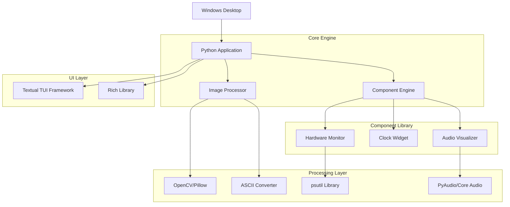

## 1. 架构设计



## 2. 技术栈描述

- **应用框架**: Python@3.9+ + Textual@0.45+ (TUI框架)
- **CLI渲染**: Rich@13.0+ (富文本和颜色支持)
- **系统监控**: psutil@5.9+ (硬件信息获取)
- **音频处理**: PyAudio@0.2+ + numpy@1.24+ (音频可视化)
- **图像处理**: Pillow@10.0+ + OpenCV@4.8+ (图像转换和像素化)
- **配置管理**: json5@0.9+ + appdirs@1.4+ (配置存储)
- **开机启动**: winreg (Windows注册表操作)

## 3. 核心模块定义

| 模块名称 | 功能描述 |
|---------|---------|
| /src/main.py | 应用入口，初始化TUI应用和主循环 |
| /src/ui/app.py | Textual应用主类，管理界面路由和状态 |
| /src/ui/display.py | 主显示界面，CLI渲染引擎 |
| /src/ui/editor.py | 可视化编辑器界面 |
| /src/ui/templates.py | 模板库浏览界面 |
| /src/components/base.py | 组件基类，定义标准接口 |
| /src/components/hardware.py | 硬件监控组件实现 |
| /src/components/clock.py | 时钟组件实现 |
| /src/components/audio.py | 音频可视化组件实现 |
| /src/core/renderer.py | CLI渲染核心，处理字符和颜色输出 |
| /src/core/layout.py | 布局管理器，处理组件定位和大小 |
| /src/core/animation.py | 动画系统，实现各种视觉效果 |
| /src/processors/image.py | 图像处理器，位图到ASCII/像素转换 |
| /src/config/manager.py | 配置管理器，保存用户设置 |
| /src/utils/startup.py | 开机启动管理工具 |

## 4. 数据模型定义

### 4.1 组件配置模型
```json
{
  "component_id": "hardware_cpu",
  "type": "hardware_monitor",
  "position": {"x": 0, "y": 0, "width": 40, "height": 10},
  "style": {
    "color_primary": "#00FF41",
    "color_secondary": "#FF00FF",
    "border_style": "double",
    "animation_speed": 10
  },
  "data_source": "cpu_usage",
  "update_interval": 1000
}
```

### 4.2 布局配置模型
```json
{
  "layout_id": "cyberpunk_default",
  "screen_size": {"width": 800, "height": 480},
  "grid_size": 16,
  "components": ["component_id_1", "component_id_2"],
  "background": {
    "type": "solid",
    "color": "#0D0208",
    "effects": ["scan_lines", "noise"]
  }
}
```

### 4.3 模板元数据模型
```json
{
  "template_id": "neon_cyberpunk",
  "name": "霓虹赛博朋克",
  "category": "cyberpunk",
  "screen_compat": ["800x480", "1024x600"],
  "components": ["clock_digital", "hardware_gpu", "audio_spectrum"],
  "preview_ascii": "...",
  "tags": ["neon", "dark", "animated"]
}
```

## 5. 核心算法设计

### 5.1 图像像素化算法
```python
class PixelConverter:
    def bitmap_to_ascii(self, image, threshold=4, charset=" .:-=+*#%@"):
        # 将图像转换为灰度
        gray = cv2.cvtColor(image, cv2.COLOR_BGR2GRAY)
        # 调整大小到目标分辨率
        resized = cv2.resize(gray, (target_width, target_height))
        # 应用阈值分割
        _, binary = cv2.threshold(resized, 128, 255, cv2.THRESH_BINARY)
        # 映射到字符集
        ascii_art = self.map_to_charset(binary, charset)
        return ascii_art
```

### 5.2 故障艺术效果
```python
class GlitchEffect:
    def apply_scan_lines(self, text, intensity=0.3):
        lines = text.split('\n')
        for i, line in enumerate(lines):
            if random.random() < intensity:
                # 随机替换字符
                line = self.random_char_replace(line)
                # 添加偏移效果
                line = " " * random.randint(0, 5) + line
        return '\n'.join(lines)
```

## 6. 性能优化策略

- **渲染优化**: 使用双缓冲技术，只更新变化区域
- **内存管理**: 组件池化复用，避免频繁对象创建
- **更新频率**: 不同组件采用差异化更新频率（硬件监控1s，音频可视化50ms）
- **缓存机制**: 图像转换结果缓存，避免重复处理
- **异步处理**: 音频采样和图像处理采用异步线程

## 7. 配置存储结构

```
%APPDATA%/DecoScreenBeautifier/
├── config/
│   ├── layouts/          # 用户自定义布局
│   ├── templates/        # 下载的模板
│   └── settings.json     # 全局设置
├── cache/
│   ├── images/          # 处理后的图像缓存
│   └── thumbnails/      # 模板缩略图
└── logs/
    └── app.log          # 运行日志
```