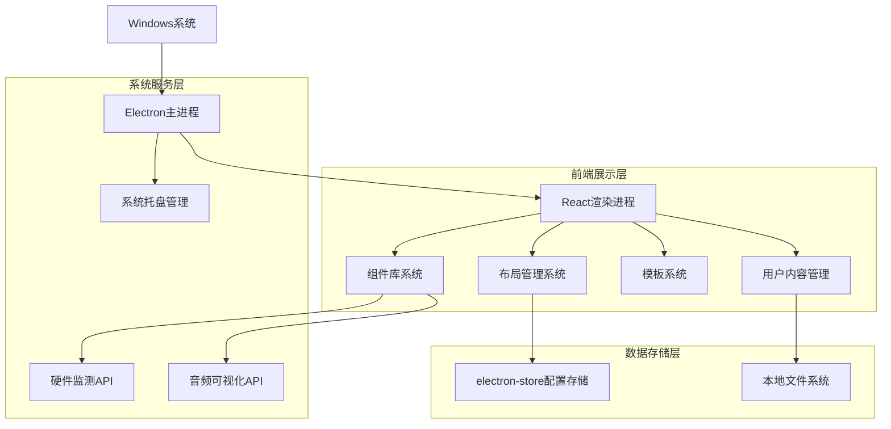
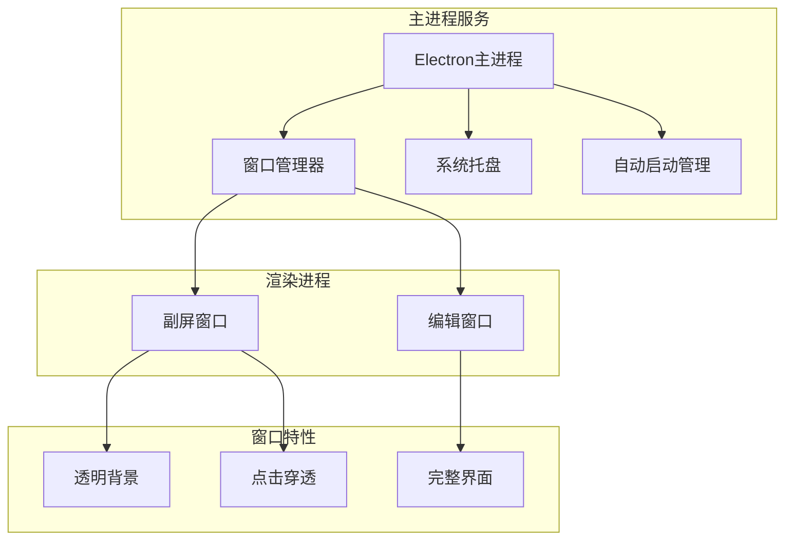

## 1. 架构设计



## 2. 技术栈描述

- **前端框架**: React@18 + TypeScript + Vite
- **UI框架**: TailwindCSS@3 + Framer Motion
- **桌面应用**: Electron@27
- **状态管理**: React Context + useReducer
- **硬件信息**: systeminformation库
- **本地存储**: electron-store
- **初始化工具**: vite-init
- **后端服务**: 无（纯客户端应用）

## 3. 路由定义

| 路由 | 用途 |
|-----|------|
| /editor | 主编辑界面，组件编辑和布局管理 |
| /settings | 设置页面，系统配置和选项 |
| /template-gallery | 模板库浏览和选择 |
| /preview | 全屏预览模式 |

## 4. 核心组件架构

### 4.1 组件系统架构
```typescript
// 基础组件接口
interface BaseWidget {
  id: string;
  type: WidgetType;
  position: { x: number; y: number };
  size: { width: number; height: number };
  style: WidgetStyle;
  data?: any;
}

// 组件类型枚举
enum WidgetType {
  CPU_MONITOR = 'cpu-monitor',
  GPU_MONITOR = 'gpu-monitor',
  RAM_MONITOR = 'ram-monitor',
  TEMP_MONITOR = 'temp-monitor',
  CLOCK = 'clock',
  AUDIO_VISUALIZER = 'audio-visualizer',
  IMAGE_STICKER = 'image-sticker',
  GIF_STICKER = 'gif-sticker',
  BACKGROUND = 'background'
}

// 组件样式接口
interface WidgetStyle {
  theme: string;
  color: string;
  opacity: number;
  fontSize?: number;
  animation?: string;
}
```

### 4.2 硬件监测API
```typescript
// 系统信息获取接口
interface SystemInfo {
  getCPUUsage(): Promise<number>;
  getGPUUsage(): Promise<number>;
  getRAMUsage(): Promise<{ used: number; total: number }>;
  getTemperature(): Promise<number>;
}

// 音频数据接口
interface AudioData {
  frequencyData: Uint8Array;
  timeData: Uint8Array;
  volume: number;
}
```

## 5. 系统架构设计



## 6. 数据模型

### 6.1 配置数据结构
```typescript
// 应用配置接口
interface AppConfig {
  version: string;
  autoLaunch: boolean;
  minimizeToTray: boolean;
  screenSize: {
    width: number;
    height: number;
  };
  currentTemplate: string;
  customWidgets: BaseWidget[];
}

// 模板数据结构
interface Template {
  id: string;
  name: string;
  description: string;
  thumbnail: string;
  screenSize: {
    width: number;
    height: number;
  };
  widgets: BaseWidget[];
  background?: {
    type: 'color' | 'image' | 'gradient';
    value: string;
  };
}
```

### 6.2 本地存储结构
```typescript
// Electron Store数据结构
interface StoreSchema {
  config: AppConfig;
  templates: Template[];
  userAssets: {
    images: string[]; // 图片文件路径
    gifs: string[];   // GIF文件路径
  };
  widgetSettings: {
    [widgetId: string]: WidgetStyle;
  };
}
```

## 7. 性能优化策略

### 7.1 渲染优化
- **虚拟化列表**: 组件库使用虚拟滚动，避免大量组件渲染
- **防抖更新**: 硬件监测数据使用防抖机制，避免频繁重渲染
- **Web Worker**: 复杂计算任务使用Web Worker，避免阻塞UI线程

### 7.2 内存管理
- **组件懒加载**: 按需加载组件代码和资源
- **缓存策略**: 系统信息缓存，设置合理的更新间隔
- **资源释放**: 及时清理不再使用的图片和动画资源

### 7.3 系统资源使用
- **帧率控制**: 动画效果限制在30fps，降低CPU占用
- **GPU加速**: 优先使用CSS transform和opacity进行动画
- **节能模式**: 提供节能选项，降低监测频率和动画效果